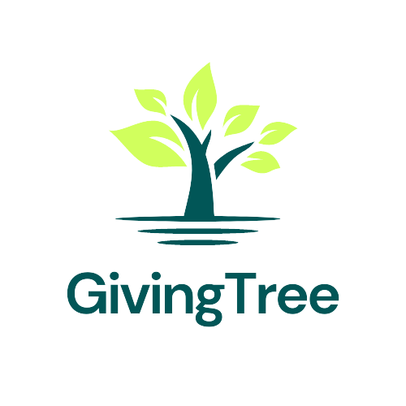

# 🌳 GivingTree - Donation & Campaign Management Platform

<div align="center">
  
  <h3>Empowering Communities Through Generous Giving</h3>
  <p><em>A comprehensive donation tracking platform that connects donors with meaningful campaigns and enables transparent fundraising for social causes.</em></p>
</div>

---

## 📖 About GivingTree

**GivingTree** is a comprehensive donation and campaign management platform built with JavaFX that facilitates transparent fundraising and donation tracking. The platform enables users to create, discover, and contribute to various social causes including education, healthcare, environmental protection, community development, and more.

Our mission is to create a trusted ecosystem where donors can confidently support causes they care about, while campaign organizers can efficiently manage their fundraising efforts with complete transparency and accountability.

---

## 🛠️ Technologies Used

### Frontend
- **JavaFX 19** - Modern Java framework for rich desktop applications
- **FXML** - Declarative UI markup language for JavaFX
- **CSS** - Custom styling for enhanced user interface

### Backend & Core
- **Java 19** - Main programming language
- **Maven** - Dependency management and build automation
- **JDBC** - Database connectivity and operations
- **MySQL** - Relational database for data persistence

### Development Environment
- **IntelliJ IDEA** - Recommended IDE for development
- **XAMPP** - Local development server (Apache + MySQL)
- **phpMyAdmin** - Database administration interface

---

## ✨ Features

### 🔐 **User Authentication & Management**
- Secure user registration and login system
- Multi-role support (Contributors, Fundraisers, Admins)
- Profile management with personal information updates
- Password reset functionality with email verification

### 💼 **Campaign Management**
- Create new fundraising campaigns with detailed descriptions
- Set campaign goals and track progress in real-time
- Multiple campaign categories (Education, Medical, Environment, etc.)
- Campaign status management (Active, Suspended)
- Image upload support for campaign visualization

### 💰 **Donation System**
- Secure donation processing with multiple payment methods
- Real-time donation tracking and confirmation
- Donation history for both donors and campaign owners
- Payment status management (Completed, Refunded)
- Donation confirmation receipts

### 🔍 **Discovery & Exploration**
- Browse and discover active campaigns
- Advanced filtering by category and status
- Detailed campaign views with progress indicators
- Search functionality for finding specific campaigns

### 👥 **User Dashboard Features**
- **My Campaigns** - Manage created fundraising campaigns
- **My Donated Campaigns** - Track personal donation history
- **Profile Management** - Update personal information and preferences
- **Notifications** - Stay updated on campaign activities

### 🛡️ **Administrative Controls**
- Comprehensive admin dashboard for platform oversight
- User management and verification
- Campaign monitoring and status controls
- Donation oversight and refund management
- System analytics and reporting

### 💬 **Communication System**
- Built-in messaging between users and administrators
- Help and support system
- Notifications for important updates

### 📊 **Transparency & Reporting**
- Real-time campaign progress tracking
- Detailed donation breakdowns
- Payment method analytics
- Campaign performance metrics

---

## 🚀 Getting Started

### Prerequisites
- **Java Development Kit (JDK) 19 or higher**
- **IntelliJ IDEA** (recommended) or any Java IDE
- **XAMPP** (for local MySQL database)
- **Maven** (usually bundled with IDE)

### Installation Steps

1. **Setup Database Environment**
   ```
   Download and install XAMPP from: https://www.apachefriends.org/
   Start Apache and MySQL services in XAMPP Control Panel
   ```

2. **Configure Database**
   - Open phpMyAdmin: `http://localhost/phpmyadmin`
   - Create a new database named `donation_tracker`
   - Import the SQL file: `donation_tracker.sql`
   - Verify all tables are created successfully

3. **Clone the Project**
   ```bash
   git clone https://github.com/M-R-Saad/GivingTree.git
   cd GivingTree
   ```

4. **Open in IDE**
   - Launch IntelliJ IDEA
   - Open the project folder
   - Allow Maven to download dependencies automatically

5. **Configure Database Connection**
   - Navigate to `src/main/java/login/Constants.java`
   - Update database credentials if necessary:
   ```java
   public static final String DATABASE_URL = "jdbc:mysql://localhost:3306/donation_tracker";
   public static final String DATABASE_USERNAME = "root";
   public static final String DATABASE_PASSWORD = "";
   ```

6. **Run the Application**
   - Navigate to `src/main/java/login/Login.java`
   - Right-click and select "Run Login.main()"
   - The application will launch with the login window

### 📁 Project Structure
```
GivingTree/
├── src/main/java/login/           # Main application source code
│   ├── Login.java                 # Application entry point
│   ├── Homepage_Controller.java   # Main dashboard controller
│   ├── Campaign_Details_Controller.java    # Campaign management
│   ├── Donation_Payment_Controller.java    # Payment processing
│   ├── DiscoverCampaignController.java     # Campaign discovery
│   ├── Admin_Dashboard*.java      # Administrative interfaces
│   ├── Constants.java             # Database configuration
│   └── *.java                     # Additional controllers and models
├── src/main/resources/login/      # FXML UI files and resources
│   ├── login.fxml                 # Login interface
│   ├── homepage.fxml              # Main dashboard
│   ├── discover_campaigns.fxml    # Campaign browser
│   ├── donation_payment.fxml      # Payment interface
│   └── *.fxml                     # Additional UI components
├── donation_tracker.sql           # Database schema and sample data
├── pom.xml                        # Maven configuration
└── README.md                      # This file
```

---

## 🎯 Usage Guide

### For Contributors (Donors):
1. **Register/Login** - Create an account or sign in to existing account
2. **Explore Campaigns** - Browse active fundraising campaigns by category
3. **Make Donations** - Support campaigns with secure payment options
4. **Track Impact** - Monitor your donation history and campaign progress
5. **Manage Profile** - Update personal information and preferences

### For Fundraisers:
1. **Create Campaigns** - Launch new fundraising initiatives with detailed descriptions
2. **Set Goals** - Define target amounts and campaign categories
3. **Track Progress** - Monitor donations and campaign performance
4. **Manage Content** - Upload images and update campaign information
5. **Communication** - Interact with donors and supporters

### For Administrators:
1. **Platform Oversight** - Monitor all campaigns and user activities
2. **User Management** - Verify accounts and manage user permissions
3. **Campaign Control** - Approve, suspend, or manage campaign status
4. **Financial Oversight** - Track donations and process refunds when needed
5. **System Analytics** - Generate reports and monitor platform performance

---

## 💳 Supported Payment Methods

- **Mobile Financial Services (MFS)** - bKash, Rocket, Nagad
- **Debit/Credit Cards** - Visa, MasterCard, American Express
- **Bank Transfer** - Direct bank account transfers

---

## 🔒 Security Features

- Secure password storage and authentication
- Session management for user security
- Input validation and SQL injection prevention
- Payment data protection and encryption
- Admin verification for sensitive operations

---

## 🤝 Contributing

We welcome contributions to improve GivingTree! Here's how you can help:

1. **Fork the repository**
2. **Create a feature branch** (`git checkout -b feature/AmazingFeature`)
3. **Commit your changes** (`git commit -m 'Add some AmazingFeature'`)
4. **Push to the branch** (`git push origin feature/AmazingFeature`)
5. **Open a Pull Request**

### Areas for Contribution:
- UI/UX improvements and modern design updates
- Additional payment gateway integrations
- Enhanced security features
- Mobile application development
- API development for third-party integrations
- Performance optimizations
- Bug fixes and testing

---

## 📄 Database Schema

The application uses a MySQL database with the following main tables:
- **userdetails** - User account information and profiles
- **campaign** - Fundraising campaign data and metadata
- **donation** - Individual donation records and payment details
- **msg_details** - Communication messages between users and admins

---

## 🆘 Support & Contact

If you encounter any issues or have questions:

- **GitHub Issues**: [Create an issue](https://github.com/M-R-Saad/GivingTree/issues)
- **Email**: Contact the development team
- **Documentation**: Refer to inline code comments and JavaDoc

---

## 📝 License

This project is available under the MIT License. See the LICENSE file for details.

---

## 🙏 Acknowledgments

- **JavaFX Community** for the excellent desktop application framework
- **MySQL** for reliable database management
- **Maven** for streamlined dependency management
- All contributors and testers who helped improve this platform

---

<div align="center">
  <h3>🌳 Make a Difference with GivingTree 🌳</h3>
  <p><em>Join our community of generous donors and dedicated fundraisers</em></p>
  <p><strong>Every donation plants a seed of hope!</strong></p>
</div>

---

*© 2025 GivingTree. Empowering communities through transparent giving.*